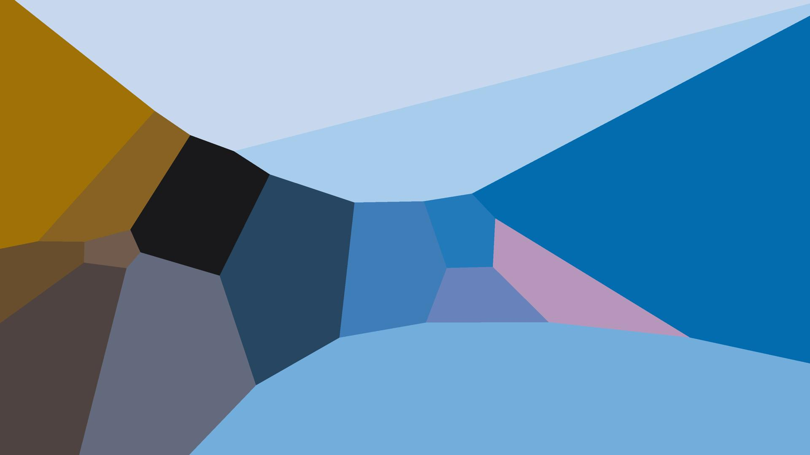
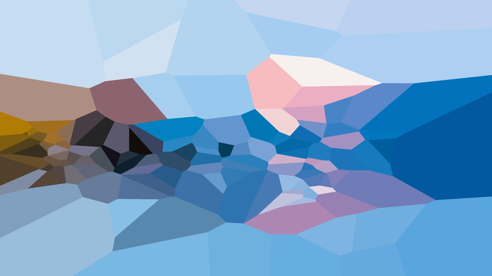

# Generative Art

This repo showcases some of my experiments with generative art.

## K-means Voronoi

[The script](src/k_means_voronoi.py) generates a Voronoi diagram using a k-means clustering algorithm. It clusters pixels from an image and then generates a Voronoi diagram based on the cluster centers. The images are generated by using the cluster center color only in the pixel position space.

The script converts the color space of the image to the LAB color space before clustering. This is done to make the clustering more perceptually accurate. I found that using the OKLab color space made the images too coherent, so I decided to use the LAB color space instead I like the results better.

### Examples

#### Original Image

#### Voronoi Diagram with 16 clusters

#### Voronoi Diagram with 128 clusters

#### Voronoi Diagram with 512 clusters

#### Voronoi Diagram with 2048 clusters

